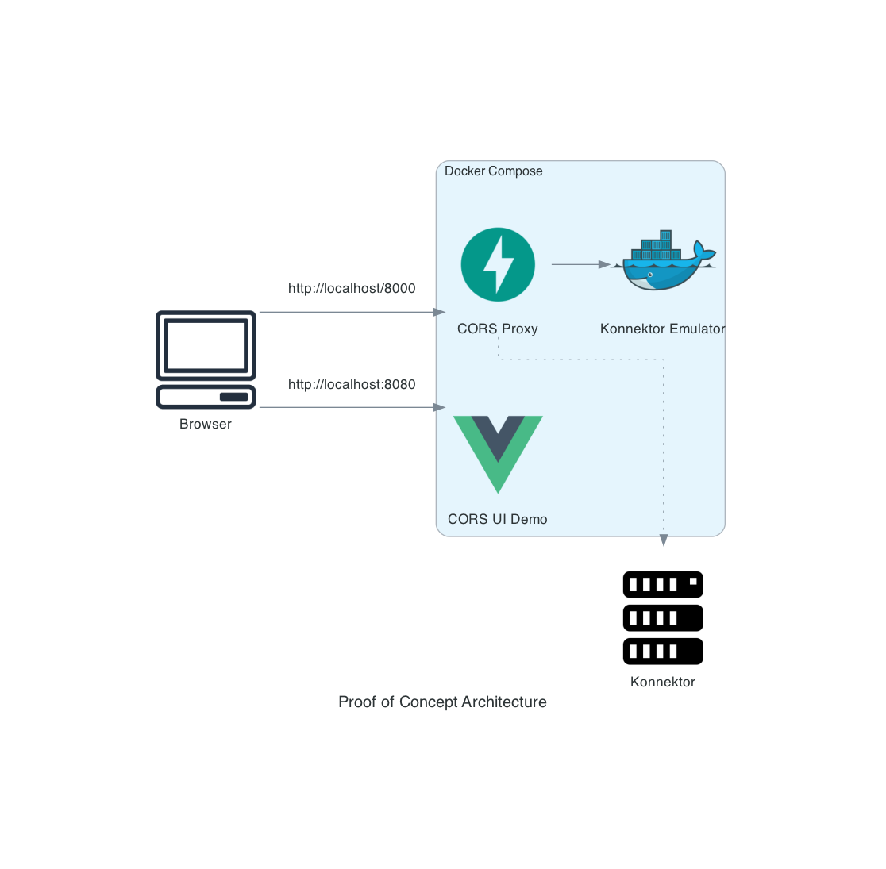

= 🪃 Proof of Concept for Konnektor with CORS

== User Stories

As a *Practitioner*, 
I want to be able to use a browser in conjunction with security features, 
so that I can use the privacy and security critical applications right without the need to install the application specific software.

As an *Application Developer*, 
I want to be able to use the APIs of Konnektor and other Telematik APIs from the browser,
so that I can provide my users easy and secure access to my web based applicationap.

Possible use cases:

* Web based KIM Secure Mail
* Signed web forms
* OpenID Connect Authentication

== Architecture

The proposal of this proof of concept is to add https://en.wikipedia.org/wiki/Cross-origin_resource_sharing[Cross-Origin Resource Sharing (CORS)] feature to the Konnektor.
By enabling CORS, the trusted web applications can access the Konnektor's SOAP API using https://en.wikipedia.org/wiki/XMLHttpRequest[XMLHttpRequest] and integrate them with the web application.

image::images/logical_architecture.png[Logical Architecture]

== Proof of Concept

The PoC consists of following components:

* Since the current Konnektors do not have the CORS, the link:cors-proxy/[`CORS Proxy`] is used to add CORS and proxy everything else. 
`CORS Proxy` ist written in Python using https://fastapi.tiangolo.com[FastAPI]
* To be able to run the PoC out of the box, very simple https://github.com/spilikin/conlibre[Konnektor API simulator] is embedded as a Docker image.
* PoC can be extended to be used with the real Konnektor box
* link:cors-ui/[`CORS UI Demo`] is a simple single page application written in https://vuejs.org[VUE]. 
The application itself is loaded from the different origin as the Konnektor API, but is able to access it, thanks to CORS.

== Run PoC

[source,bash]
----
docker compose up --build -d
# Test if it's working
curl http://localhost:8080
curl -u "admin:konnektor" http://localhost:8000/connector.sds
----

Open `http://localhost:8080` in browser.